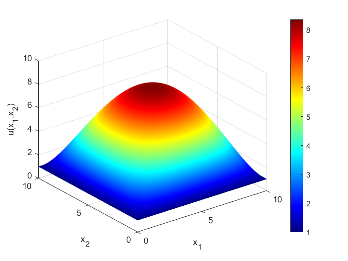
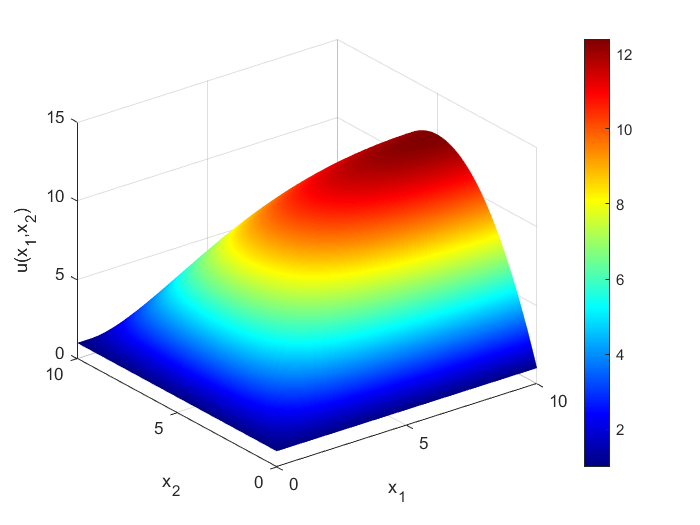

# Méthode des différences finies avec Matlab

## Introduction

### Problèmes traités

#### Domaine $\Omega$ et maillage

Pour tous les problèmes traités, le domaine  $\Omega$ sera un carré de dimension $D \times D$, avec un maillage carré dont les sommets sont au nombre de $N \times N$.

Le pas spatial élémentaire du maillage sera donc $h_x=\dfrac{D}{N-1}$.

#### Conditions aux limites

Pour tous les problèmes traités, des conditions aux limites de Dirichlet ou de Neumann seront imposées sur chaque côté du carré. Dans les programmes proposés, les côtés où ces conditions sont imposées, sont arbitrairement fixés et seules les valeurs imposées sont paramétrables.

#### Problèmes stationnaires

On résoudra numériquement l'équation $-\Delta u + au = f$, avec différentes conditions aux limites. 

#### Problèmes d'évolution

On résoudra numériquement l'équation de la chaleur $\dfrac{\partial u}{\partial t} = \gamma \Delta u$ ainsi que l'équation des ondes $\dfrac{\partial^2 u}{\partial t^2} = \gamma \Delta u$.

Pour l'équation de la chaleur, on pourra tester les méthodes d'Euler implicites et explicites.

Pour l'équation des ondes, on pourra tester la méthode de Runge-Kutta d'ordre 4.

### Schémas numériques et stabilité

Pour l'équation de la chaleur $\dfrac{\partial u}{\partial t} = \gamma \Delta u$, on pourra calculer numériquement le rayon spectral de la matrice intervenant dans la méthode d'Euler, dans le cas implicite et explicite. 

Pour chaque instant $t_n=nh_t$ avec un pas temporel $h_t$, on approxime le laplacien sous la forme $\Delta u \approx AU_n+B$, où $U_n$ est un vecteur rassemblant les valeurs de la fonction $u(t_n)$ aux noeuds du maillage carré dans le domaine $\Omega$. $A$ est une matrice et $B$ est un vecteur, qui dépendent notamment des conditions aux limites.

Pour l'équation de la chaleur, les équations d'Euler explicites et implicites sont respectivement $U_{n+1} = U_n + h_t \gamma \left(AU_n+B\right)$ et $U_{n+1} = U_n + h_t \gamma \left(AU_{n+1}+B\right)$.

On obtient finalement pour le schéma explicite :

$$
U_{n+1} = \left(I+h_t\gamma A\right)U_n+h_t\gamma B
$$

et pour le schéma implicite :

$$
U_{n+1} = \left(I-h_t\gamma A\right)^{-1}\left(U_n+h_t \gamma B\right)
$$

Pour l'équation des ondes $\dfrac{\partial^2 u}{\partial t^2} = \gamma \Delta u$, on se ramène à la résolution numérique d'une équation différentielle ordinaire $\dfrac{dX(t)}{dt}=F(X(t))$, avec un vecteur d'état $X(t)$ défini ci-dessous, où $U(t)$ est un vecteur rassemblant les valeurs de la fonction $u(t)$ aux noeuds du maillage carré dans le domaine $\Omega$.

$$
X(t) = \begin{pmatrix}U(t)\\\dfrac{dU(t)}{dt}\end{pmatrix}
$$

$$
\dfrac{dX(t)}{dt} = \begin{pmatrix}\dfrac{dU(t)}{dt}\\  \gamma \left(AU(t)+B\right) \end{pmatrix} = F(X(t))
$$

## Quelques exemples

### Problèmes stationnaires

Les programmes sont dans l'archive **df2d_stat.zip**, dossier **CODE**.

```matlab
>> N=501;D=10;ul=1;gl=0;a=0;f=1;
>> df2d_statique(N,D,ul,gl,a,f)
```




### Problèmes d'évolution

#### Equation de la chaleur

Les programmes sont dans l'archive **df2d_chal.zip**, dossier **CODE**.

```matlab
>> resolexpl=0;ht=0.05;N=51;f=10;D=1;T=10;gamm=0.01;
>> df2d_simu_dirichlet(resolexpl,ht,N,f,D,T,gamm)
Résolution implicite
ht=0.05  hx=0.02
gamma*ht/hx^2=1.25
Minimum et maximum de la fonction en fin de simulation
   10.0000   10.1475
```

[

```matlab
>> resolexpl=0;ht=0.05;N=51;f=10;g=0;D=1;T=10;gamm=0.01;
>> df2d_simu_dirichlet_neumann(resolexpl,ht,N,f,g,D,T,gamm)
Résolution implicite
ht=0.05  hx=0.02
gamma*ht/hx^2=1.25
Minimum et maximum de la fonction en fin de simulation
   10.0000   10.2174
```

[

```matlab
>> resolexpl=0;ht=0.05;N=51;g=0;D=1;T=10;gamm=0.01;
>> df2d_simu_neumann(resolexpl,ht,N,g,D,T,gamm)
Résolution implicite
ht=0.05  hx=0.02
gamma*ht/hx^2=1.25
Minimum et maximum de la fonction en fin de simulation
   10.3356   10.3662
```

[

Avec l'exemple de calcul de rayons spectraux ci-dessous et dans les conditions des simulations précédentes, on peut constater que la méthode implicite, avec la matrice $\left(I-h_t\gamma A\right)^{-1}$, est stable (rayon spectral inférieur à 1), et la méthode explicite avec la matrice $\left(I+h_t\gamma A\right)$, est instable (rayon spectral supérieur à 1).

```matlab
>> ht=0.05;N=51;D=1;gamm=0.01;
>> rayon_spectral(ht,N,D,gamm)
ht=0.05  hx=0.02
gamma*ht/hx^2=1.25
Dirichlet
rayon spectral de (I+ht*gamma*A)    = 8.9901
rayon spectral de (I-ht*gamma*A)^-1 = 0.99023
Dirichlet-Neumann
rayon spectral de (I+ht*gamma*A)    = 8.9938
rayon spectral de (I-ht*gamma*A)^-1 = 0.99387
Neumann
rayon spectral de (I+ht*gamma*A)    = 9
rayon spectral de (I-ht*gamma*A)^-1 = 1
```

#### Equation des ondes

Les programmes sont dans l'archive **df2d_evol.zip**, dossier **CODE**.

```matlab
>> ht=0.05;N=201;D=1;T=1/(2*sqrt(2*0.01));gamm=0.01;
>> df2d_propag_dirichlet_rk45(ht,N,D,T,gamm)
ht=0.05  hx=0.005
sqrt(gamma)*ht/hx=1
Minimum et maximum de la fonction en fin de simulation
   -0.9979    0.9979
```

[

```matlab
>> ht=0.05;N=201;g=0;D=1;T=20;gamm=0.01;
>> df2d_propag_neumann_rk45(ht,N,g,D,T,gamm)
ht=0.05  hx=0.005
sqrt(gamma)*ht/hx=1
Minimum et maximum de la fonction en fin de simulation
   -0.1285    0.2646
```

[

